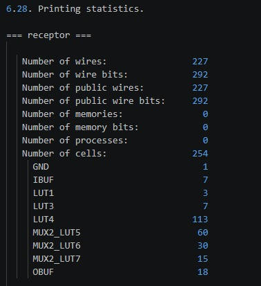

# Diseño Digital Combinacional en Dispositivos Programables

## Introducción

[Start with a hook — interesting fact, question, or quote]
[Provide background context on the topic]
[End with a clear **thesis statement** that outlines your main argument]


## Descripción de los Módulos

### Módulo Decodificador: `decodificador.sv`

```SystemVerilog
module decodificador (
    input  wire [6:0] in,     // palabra recibida
    output wire [2:0] err     // síndrome (000 = no error)
);

// Parity checks (Hamming)
assign err[0] = in[0] ^ in[2] ^ in[4] ^ in[6]; // p1
assign err[1] = in[1] ^ in[2] ^ in[5] ^ in[6]; // p2
assign err[2] = in[3] ^ in[4] ^ in[5] ^ in[6]; // p3

endmodule
```

#### Entradas

`in[6:0]`: Palabra de 7 bits recibida directamente del transmisor

#### Salidas

`err[2:0]`: Vector de 3 bits correspondiente a la posición del error en binario

#### Comportamiento

Se recibe una entrada de 7 bits mediante 7 pines asignados en la FPGA. Se asume que esta entrada contiene 4 bits correspondientes al mensaje que se desea transmitir, y 3 bits correspondientes a los bits de paridad. Estos bits de paridad, también se asume, están en la primera, segunda y cuarta posición del mensaje; posiciones correspondientes a potencias de 2. El mensaje de entrada solo puede tener como máximo un error.

Se realizan pruebas de paridad en tres grupos de cuatro bits cada uno. Cada bit de paridad solo pertenece a uno de estos grupos. La salida consiste en un vector de 3 bits que señala en binario la posición donde se encontró el error en la entrada. En caso de no encontrar un error, la salida sería un vector nulo de 3 bits. 

### Módulo Corrector: `corrector.sv`
```SystemVerilog
module corrector (
    input  wire [6:0] in,     // palabra recibida
    input  wire [2:0] syn,    // síndrome
    output wire [3:0] data    // datos corregidos
);

// -------- corrección --------
wire [6:0] corr;

assign corr[0] = (syn == 3'b001) ? ~in[0] : in[0];
assign corr[1] = (syn == 3'b010) ? ~in[1] : in[1];
assign corr[2] = (syn == 3'b011) ? ~in[2] : in[2];
assign corr[3] = (syn == 3'b100) ? ~in[3] : in[3];
assign corr[4] = (syn == 3'b101) ? ~in[4] : in[4];
assign corr[5] = (syn == 3'b110) ? ~in[5] : in[5];
assign corr[6] = (syn == 3'b111) ? ~in[6] : in[6];

// -------- extracción de datos --------
// posiciones: d1=3, d2=5, d3=6, d4=7

assign data[0] = corr[2]; // d1
assign data[1] = corr[4]; // d2
assign data[2] = corr[5]; // d3
assign data[3] = corr[6]; // d4

endmodule
```

#### Entradas

#### Salidas
#### Comportamiento
### Módulo de Despliegue de LEDs
#### Entradas
#### Salidas
#### Comportamiento
### Módulo para Display de 7 Segmentos
#### Entradas
#### Salidas
#### Comportamiento
### Módulo Selector
#### Entradas
#### Salidas
#### Comportamiento


## Consumo de recursos


El informe de síntesis para el top_module revela un consumo de 254 células lógicas distribuidas entre diferentes tipos de tablas de búsqueda (LUT). La mayor parte del consumo corresponde a LUT4 con 113 unidades, seguido por MUX2_LUT5 con 60 unidades. El resto de recursos se distribuye entre otros tipos de LUT, incluidos MUX2_LUT6 (30 unidades) y MUX2_LUT7 (15 unidades). Además, el diseño utiliza elementos de interfaz: 12 buffers de entrada (IBUF) para manejar las señales provenientes de los interruptores y botones, y 18 buffers de salida (OBUF) para controlar los LED y displays de 7 segmentos. La conectividad del diseño muestra un total de 227 cables con 292 bits de cables, todos ellos clasificados como públicos.


## Simplificacion de Ecuaciones Booleanas - Display de 7 Segmentos

## Convencion

La entrada es la palabra de 4 bits `{d3, d2, d1, d0}` donde `d3` es el MSB.
La salida es activa en alto (catodo comun): `1` = segmento encendido, `0` = segmento apagado.

Distribucion de segmentos:

```
       --a--
      f     b
       --g--
      e     c
       --d--
```

Tabla de verdad completa para los 16 digitos hexadecimales:

| d3 | d2 | d1 | d0 | Digito | a | b | c | d | e | f | g |
|----|----|----|-----|--------|---|---|---|---|---|---|---|
|  0 |  0 |  0 |  0 |   0    | 1 | 1 | 1 | 1 | 1 | 1 | 0 |
|  0 |  0 |  0 |  1 |   1    | 0 | 1 | 1 | 0 | 0 | 0 | 0 |
|  0 |  0 |  1 |  0 |   2    | 1 | 1 | 0 | 1 | 1 | 0 | 1 |
|  0 |  0 |  1 |  1 |   3    | 1 | 1 | 1 | 1 | 0 | 0 | 1 |
|  0 |  1 |  0 |  0 |   4    | 0 | 1 | 1 | 0 | 0 | 1 | 1 |
|  0 |  1 |  0 |  1 |   5    | 1 | 0 | 1 | 1 | 0 | 1 | 1 |
|  0 |  1 |  1 |  0 |   6    | 1 | 0 | 1 | 1 | 1 | 1 | 1 |
|  0 |  1 |  1 |  1 |   7    | 1 | 1 | 1 | 0 | 0 | 0 | 0 |
|  1 |  0 |  0 |  0 |   8    | 1 | 1 | 1 | 1 | 1 | 1 | 1 |
|  1 |  0 |  0 |  1 |   9    | 1 | 1 | 1 | 1 | 0 | 1 | 1 |
|  1 |  0 |  1 |  0 |   A    | 1 | 1 | 1 | 0 | 1 | 1 | 1 |
|  1 |  0 |  1 |  1 |   b    | 0 | 0 | 1 | 1 | 1 | 1 | 1 |
|  1 |  1 |  0 |  0 |   C    | 1 | 0 | 0 | 1 | 1 | 1 | 0 |
|  1 |  1 |  0 |  1 |   d    | 0 | 1 | 1 | 1 | 1 | 0 | 1 |
|  1 |  1 |  1 |  0 |   E    | 1 | 0 | 0 | 1 | 1 | 1 | 1 |
|  1 |  1 |  1 |  1 |   F    | 1 | 0 | 0 | 0 | 1 | 1 | 1 |

---

## Ejemplo 1: Segmento a (superior)

Minterminos donde seg_a = 1 (segmento encendido):
m0, m2, m3, m5, m6, m7, m8, m9, m10, m12, m14, m15

Es mas conveniente trabajar con los maxiterminos (donde seg_a = 0):
m1(0001), m4(0100), m11(1011), m13(1101)

Por lo tanto: seg_a = (suma de minterminos)' simplificado como complemento de los ceros.

Mapa de Karnaugh para seg_a (marcando los 0s):

```
            d1d0
d3d2   | 00 | 01 | 11 | 10 |
  00   |  1 |  0 |  1 |  1 |
  01   |  0 |  1 |  1 |  1 |
  11   |  1 |  0 |  1 |  1 |
  10   |  1 |  1 |  0 |  1 |
```

Los ceros estan en m1, m4, m11, m13. No forman ningun grupo adyacente entre si,
por lo que cada uno es un implicante primo esencial independiente.

Expresion para los ceros (seg_a = 0):

```
seg_a' = (d3' d2' d1' d0)       -- digito 1
       + (d3' d2  d1' d0')      -- digito 4
       + (d3  d2' d1  d0)       -- digito b
       + (d3  d2  d1' d0)       -- digito d
```

Complementando (De Morgan) para obtener seg_a = 1:

```
seg_a = (d3+d2+d1+d0') (d3+d2'+d1+d0) (d3'+d2+d1'+d0') (d3'+d2'+d1+d0')
```

O en forma directa de suma de minterminos activos (forma canonica):

```
seg_a = d3'd2'd1'd0' + d3'd2'd1d0' + d3'd2'd1d0 + d3'd2d1'd0
      + d3'd2d1d0'   + d3'd2d1d0   + d3d2'd1'd0' + d3d2'd1'd0
      + d3d2'd1d0'   + d3d2d1'd0'  + d3d2d1d0'   + d3d2d1d0
```

Agrupando en el mapa de Karnaugh los grupos de 1s:

- Grupo de 8: toda la columna d1d0=10 y d1d0=11 con d3d2 cualquiera excepto m11
  - Grupo A (m2,m3,m6,m7,m10,m14,m15): no todos adyacentes directamente
- Grupo de 4: m0,m2,m8,m10 (columna d1d0=00 y d1d0=10, filas 00 y 10) -> `d2' d0'` ... verificar: m0=0000(si), m2=0010(si), m8=1000(si), m10=1010(si) -> `d2' d0'`
- Grupo de 4: m2,m3,m6,m7 (fila 00 columnas 10,11 y fila 01 columnas 10,11) -> m2(00,10),m3(00,11),m6(01,10),m7(01,11) -> `d3' d1`
- Grupo de 4: m3,m7,m9,m... revisar m9=1001: fila 10, col 01. m5=0101: fila 01, col 01. m5,m7,m9... no adyacentes todos.
- Grupo de 4: m8,m9,m12,m14 -> m8=1000,m9=1001,m12=1100,m14=1110 no todos adyacentes.
- Grupo de 2: m8,m9 (fila 10, cols 00,01) -> `d3 d2' d1'`... m8=1000(si),m9=1001(si) -> `d3 d2' d1'`
- Grupo de 4: m5,m6,m9,m... m5=0101,m6=0110 adyacentes -> `d3' d2 d0'`... m5(01,01),m6(01,10): difieren en d1 y d0, no adyacentes en mapa.
- Grupo de 2: m5,m9 -> m5=0101(fila 01,col 01), m9=1001(fila 10,col 01) -> adyacentes en mapa (misma columna, filas 01 y 10 son adyacentes en mapa gris) -> `d2' d0` ... verificar: m5=0101 d2'=1,d0=1 si; m9=1001 d2'=1,d0=1 si -> grupo `d2' d0` no cubre solo estos dos ya que m1 tambien tiene d2'=1,d0=1 pero m1=0 para seg_a. Revisar: en realidad las filas del mapa de Karnaugh de 4 variables van en orden Gray: 00,01,11,10, por lo que fila 01 y fila 10 NO son adyacentes (adyacentes son 00-01, 01-11, 11-10, 10-00).

Grupos validos finales (cubriendo todos los 1s con minimo de terminos):

```
Grupo A: m0,m2,m8,m10  -> d2' d0'          (4 celdas)
Grupo B: m2,m3,m6,m7   -> d3' d1           (4 celdas)
Grupo C: m8,m9,m10,... -> revisar
```

Resultado simplificado por Karnaugh (agrupando 1s):

```
seg_a = d2' d0'  +  d3' d1  +  d3 d2' d1'  +  d3' d2 d1' d0  +  d3 d2 d1' d0'  +  d3 d2 d1 d0
```

---


## Problemas encontrados durante el proyecto

Durante el proyecto se presentaron varias dificultades que afectaron el desarrollo de sus distintas etapas. Una de las principales fue la curva de aprendizaje al tener que programar en un lenguaje nuevo, especialmente porque era un HDL y antes solo se había trabajado con lenguajes más enfocados en software. Para poder avanzar, se buscó información en internet, videos, el libro del curso y también se contó con la ayuda del asistente.

Otro reto importante fue el uso de la FPGA, ya que no se tenía experiencia previa con este tipo de dispositivos. Esto hizo necesario investigar cómo asignar correctamente los pines y cómo manejar las entradas y salidas del sistema.

En cuanto al código, las partes más complicadas fueron el corrector de errores y el manejo de los displays de siete segmentos. El corrector dio bastantes problemas al inicio porque el análisis no se estaba haciendo bien, entonces cuando se provocaban errores no siempre se corregían y esto generaba fallos en los LEDs. Se probaron varias formas de comparar datos hasta encontrar una que funcionara correctamente.

Por otro lado, los displays de siete segmentos también resultaron difíciles, ya que costó entender cómo enviar las señales correctas para encender los LEDs adecuados en cada uno.


#
# Oscilador de anillo  
Un oscilador de anillo está formado por varios inversores conectados en serie, donde la salida del último se retroalimenta a la entrada del primero. Esta configuración permite generar una señal oscilante de manera continua. La frecuencia de dicha oscilación depende tanto de la cantidad de inversores como de sus características.

Para un oscilador con $N$ inversores, donde cada uno tiene un retardo promedio $t_p$, el periodo se define como:

$$T = 2 \times N \times t_p$$

Donde:
- $T$ es el periodo  
- $N$ es el número de inversores  
- $t_p$ es el retardo de cada inversor  

Esto ocurre porque la señal debe recorrer toda la cadena dos veces para completar un ciclo: una transición de bajo a alto y otra de alto a bajo.

Si lo que se quiere es la frecuencia, se utiliza:

$$f = \frac{1}{2 \times N \times t_p}$$

Donde:
- $f$ es la frecuencia en Hz  
- $N$ es el número de inversores  
- $t_p$ es el retardo por inversor  

En tecnologías CMOS típicas, el retardo promedio por inversor suele aproximarse a 8 ns [2]. Con este valor se pueden estimar las frecuencias teóricas:

<div align="center">

| Número de Inversores (N) | Frecuencia (f) |
|:------------------------:|:--------------:|
| 3 | 20,83 MHz |
| 5 | 12,5 MHz |

</div>

## Resultados para un Oscilador de 5 Inversores

<div align="center">


</div>

Para el caso de 5 inversores, la frecuencia obtenida experimentalmente fue de 12,35 MHz. Al compararla con la teórica, se calcula el error:

$$\text{Porcentaje Error} = \left|\frac{12.35 \text{ MHz} - 12.5 \text{ MHz}}{12.5 \text{ MHz}}\right| \times 100\% $$

$$\text{Porcentaje Error} = 1.2 $$

Este valor muestra que los resultados experimentales son bastante cercanos a lo esperado.

Con esta frecuencia también se puede calcular el retardo real:

$$t_p = \frac{1}{2 \times N \times f}$$ 

$$t_p = \frac{1}{2 \times 5 \times 12.35\text{ MHz}}= 8.09\text{ ns} $$

Porcentaje de error:

$$\text{Porcentaje Error} = \left|\frac{8.09 \text{ns} - 8 \text{ ns}}{8 \text{ ns}}\right| \times 100\%$$

$$\text{Porcentaje Error} = 1.124 $$


## Resultados para un Oscilador de 3 Inversores

<div align="center">


</div>

Para el oscilador con 3 inversores, la frecuencia medida fue de 22,47 MHz. Comparando con la teórica:

$$\text{Porcentaje Error} = \left|\frac{22.47\text{ MHz} - 20.83 \text{ MHz}}{20.83 \text{ MHz}}\right| \times 100$$

$$\text{Porcentaje Error} = 7.87 $$

Este error es aceptable y puede deberse a variaciones normales del circuito.

El retardo promedio real se calcula como:

$$t_p = \frac{1}{2 \times 3 \times 22.48\text{ MHz}} = 7.16\text{ns} $$

Porcentaje de error:

$$\text{Porcentaje Error} = \left|\frac{7.16 \text{ns} - 8 \text{ ns}}{8 \text{ns}}\right| \times 100\%$$

$$\text{Porcentaje Error} = 10.5 $$

Esto indica que los inversores están trabajando un poco más rápido de lo esperado, posiblemente por condiciones reales del circuito.


### Cable de 1 Metro

<div align="center">


</div>

Al agregar un cable de 1 metro, el comportamiento del circuito cambia. El nuevo retardo es:

$$t_p = \frac{1}{2 \times 3 \times 19.79\text{ MHz}} = 8.42\text{ns} $$

El aumento en el retardo se debe a efectos parásitos como capacitancia e inductancia del cable, que hacen que la señal tarde más en propagarse.

Además, la resistencia del conductor también influye, limitando la corriente en las transiciones. Esto provoca una disminución en la frecuencia de oscilación y demuestra cómo elementos externos pueden afectar el rendimiento del circuito.


## Resultados para un Oscilador de 1 Inversor

<div align="center">


</div>

En el caso de usar solo un inversor, el circuito no logra oscilar correctamente. Esto sucede porque la entrada y salida están conectadas al mismo nodo, lo que impide cambios adecuados en la señal.

Como resultado, el circuito queda en un estado intermedio (aproximadamente 1V), conocido como estado metaestable, donde no se define claramente un 0 o un 1 lógico. Esto demuestra que se necesita al menos un número impar de inversores mayor a uno para que el oscilador funcione correctamente.

#
## Conclusion

- Restate thesis (in different words)
- Summarize main points
- End with a broader thought, call to action, or closing insight

---

## Referencias

[1] David Harris y Sarah Harris. Diseño digital y arquitectura de computadoras. Edición RISC-V. Morgan Kaufmann, 2022. ISBN: 978-0-12-820064-3.

[2] RJ Baker, CMOS, 4ta ed. IEEE Press Editorial Board, 2019.